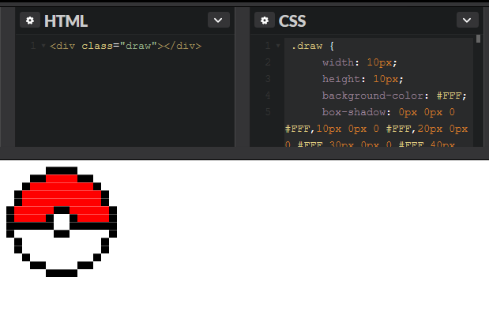

# crisgon
A box-shadow-based pixel images generator<br>
Inpired by [Desenhando com box shadow](https://crisgon.github.io/posts/Desenhando-com-box-shadow/)

#### pokeball.cgn
```python
size 10

def _ #FFF
def x #000
def o #F00

[_____xxxx_____]
[___xxooooxx___]
[__xoooooooox__]
[_xoooooooooox_]
[_xoooooooooox_]
[xoooooxxooooox]
[xoooox__xoooox]
[xxxxxx__xxxxxx]
[x_____xx_____x]
[_x__________x_]
[_x__________x_]
[__x________x__]
[___xx____xx___]
[_____xxxx_____]
```

```bash
[node] crisgonc pokeball.cgn
```

CSS
```css
 .draw {
   width: 10px;
   height: 10px;
   background-color: #FFF;
   box-shadow: 0px 0px 0 #FFF,10px 0px 0 #FFF,20px 0px 0 #FFF,30px 0px 0 #FFF,40px 0px 0 #FFF,50px 0px 0 #000,60px 0px 0 #000,70px 0px 0 #000,80px 0px 0 #000,90px 0px 0 #FFF,100px 0px 0 #FFF,110px 0px 0 #FFF,120px 0px 0 #FFF,130px 0px 0 #FFF,0px 10px 0 #FFF,10px 10px 0 #FFF,20px 10px 0 #FFF,30px 10px 0 #000,40px 10px 0 #000,50px 10px 0 #F00,60px 10px 0 #F00,70px 10px 0 #F00,80px 10px 0 #F00,90px 10px 0 #000,100px 10px 0 #000,110px 10px 0 #FFF,120px 10px 0 #FFF,130px 10px 0 #FFF,0px 20px 0 #FFF,10px 20px 0 #FFF,20px 20px 0 #000,30px 20px 0 #F00,40px
20px 0 #F00,50px 20px 0 #F00,60px 20px 0 #F00,70px 20px 0 #F00,80px 20px 0 #F00,90px 20px 0 #F00,100px 20px 0 #F00,110px 20px 0 #000,120px 20px 0 #FFF,130px 20px 0 #FFF,0px 30px 0 #FFF,10px 30px 0 #000,20px 30px 0 #F00,30px 30px 0 #F00,40px 30px 0 #F00,50px 30px 0 #F00,60px 30px 0 #F00,70px 30px 0 #F00,80px 30px 0 #F00,90px 30px 0 #F00,100px 30px 0 #F00,110px 30px 0 #F00,120px 30px 0 #000,130px 30px 0 #FFF,0px 40px 0 #FFF,10px 40px 0 #000,20px 40px 0 #F00,30px
40px 0 #F00,40px 40px 0 #F00,50px 40px 0 #F00,60px 40px 0 #F00,70px 40px 0 #F00,80px 40px 0 #F00,90px 40px 0 #F00,100px 40px 0 #F00,110px 40px 0 #F00,120px 40px 0 #000,130px 40px 0 #FFF,0px 50px 0 #000,10px 50px 0 #F00,20px 50px 0 #F00,30px 50px 0 #F00,40px 50px 0 #F00,50px 50px 0 #F00,60px 50px 0 #000,70px 50px 0 #000,80px 50px 0 #F00,90px 50px 0 #F00,100px 50px 0 #F00,110px 50px 0 #F00,120px 50px 0 #F00,130px 50px 0 #000,0px 60px 0 #000,10px 60px 0 #F00,20px
60px 0 #F00,30px 60px 0 #F00,40px 60px 0 #F00,50px 60px 0 #000,60px 60px 0 #FFF,70px 60px 0 #FFF,80px 60px 0 #000,90px 60px 0 #F00,100px 60px 0 #F00,110px 60px 0 #F00,120px 60px 0 #F00,130px 60px 0 #000,0px 70px 0 #000,10px 70px 0 #000,20px 70px 0 #000,30px 70px 0 #000,40px 70px 0 #000,50px 70px 0 #000,60px 70px 0 #FFF,70px 70px 0 #FFF,80px 70px 0 #000,90px 70px 0 #000,100px 70px 0 #000,110px 70px 0 #000,120px 70px 0 #000,130px 70px 0 #000,0px 80px 0 #000,10px
80px 0 #FFF,20px 80px 0 #FFF,30px 80px 0 #FFF,40px 80px 0 #FFF,50px 80px 0 #FFF,60px 80px 0 #000,70px 80px 0 #000,80px 80px 0 #FFF,90px 80px 0 #FFF,100px 80px 0 #FFF,110px 80px 0 #FFF,120px 80px 0 #FFF,130px 80px 0 #000,0px 90px 0 #FFF,10px 90px 0 #000,20px 90px 0 #FFF,30px 90px 0 #FFF,40px 90px 0 #FFF,50px 90px 0 #FFF,60px 90px 0 #FFF,70px 90px 0 #FFF,80px 90px 0 #FFF,90px 90px 0 #FFF,100px 90px 0 #FFF,110px 90px 0 #FFF,120px 90px 0 #000,130px 90px 0 #FFF,0px
100px 0 #FFF,10px 100px 0 #000,20px 100px 0 #FFF,30px 100px 0 #FFF,40px 100px 0 #FFF,50px 100px 0 #FFF,60px 100px 0 #FFF,70px 100px 0 #FFF,80px 100px 0 #FFF,90px 100px 0 #FFF,100px 100px 0 #FFF,110px 100px 0 #FFF,120px 100px 0 #000,130px 100px 0 #FFF,0px 110px 0 #FFF,10px 110px
0 #FFF,20px 110px 0 #000,30px 110px 0 #FFF,40px 110px 0 #FFF,50px 110px 0 #FFF,60px 110px 0 #FFF,70px 110px 0 #FFF,80px 110px 0 #FFF,90px 110px 0 #FFF,100px 110px 0 #FFF,110px 110px 0 #000,120px 110px 0 #FFF,130px 110px 0 #FFF,0px 120px 0 #FFF,10px 120px 0 #FFF,20px 120px 0 #FFF,30px 120px 0 #000,40px 120px 0 #000,50px 120px 0 #FFF,60px 120px 0 #FFF,70px 120px 0 #FFF,80px 120px 0 #FFF,90px 120px 0 #000,100px 120px 0 #000,110px 120px 0 #FFF,120px 120px 0 #FFF,130px 120px 0 #FFF,0px 130px 0 #FFF,10px 130px 0 #FFF,20px 130px 0 #FFF,30px 130px 0 #FFF,40px
130px 0 #FFF,50px 130px 0 #000,60px 130px 0 #000,70px 130px 0 #000,80px 130px 0 #000,90px 130px 0 #FFF,100px 130px 0 #FFF,110px 130px 0 #FFF,120px 130px 0 #FFF,130px 130px 0 #FFF;
}
```


